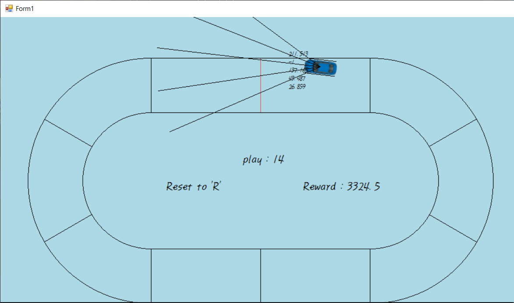
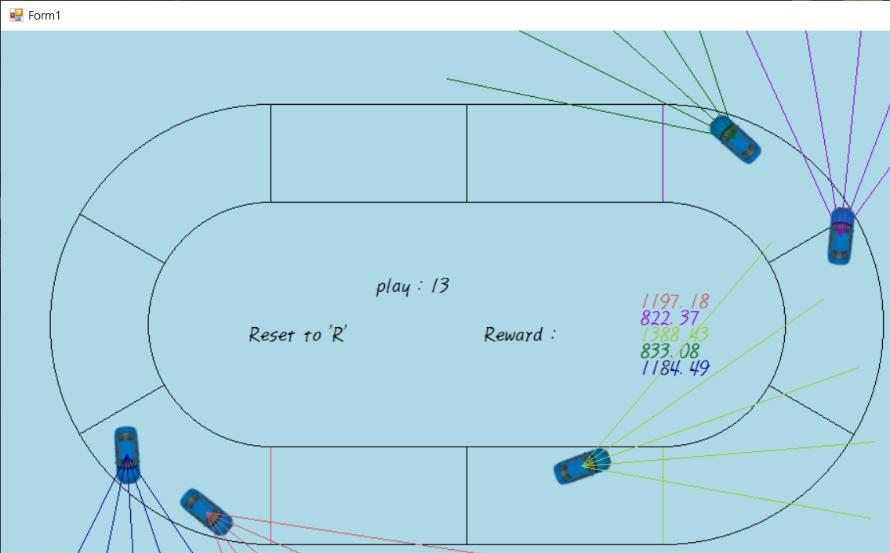

# CarDrive_1

tensorflow를 활용하여 차량이 스스로 움직일 수 있게 학습시키는 강화학습 프로젝트
- tensorflow를 활용해 DQN을 구성하고 이를 강화학습에 활용한다. 구현에는 python을 사용했다.
- 학습 상황을 화면에 그래픽으로 출력한다. 이의 구현에는 C#을 사용했다.
- 개발 기간은 약 2개월

CarDrive_network.py를 실행시켜 학습을 시작할 수 있다.
- 차량에게는 상하좌우와 정지를 조합한 총 9종류의 이동 명령을 내릴 수 있다.
- 차량은 타원형의 트랙을 따라 벽에 부딪히지 않고 주행하는 것이 목표이며, 수행한 행동의 결과에 따라 일정한 보상을 받는다.
- DQN의 입력값으로 차량의 속도와 차량 정면의 5가지 각도에서 측정한 장애물과의 거리를 입력한다.
- DQN은 입력된 정보를 바탕으로 차량에게 내릴 명령을 결정한다.  
- 입력값에 따라 결정된 명령과 보상의 상관관계를 이용해 차량이 최적의 경로로 주행하도록 학습시키는 것이 프로젝트의 목표이다.

단순히 학습을 시키는 것 뿐만 아니라 학습 과정과 학습 단계에 따른 결과값의 변화, 학습의 결과를 눈으로 보는 것이 이 프로젝트의 목표이다.
- 따라서 차량이 움직이는 것을 직접 볼 수 있게 그래픽 요소를 추가하고, 학습을 빠르게 시키는 것보다 차량의 이동도 볼 수 있도록 계산 속도를 타이머로 조절했다.

2인 팀프로젝트이지만 거의 대부분의 개발을 맡았다.

작동 화면
==================
작동 화면들은 현재 코드로 볼 수 있는 화면이 아닌, 프로젝트의 진행 상황에 따라 다른 여러 시점의 화면이다.

- 트랙은 화면과 같이 타원형으로 구성된다.
- 차량은 아래쪽 중앙에서 출발하여 트랙을 따라 시계 반대 방향으로 주행한다.
- 트랙을 벗어나면 트랙 이탈로 보상을 잃고 처음부터 다시 출발한다.
- 트랙에 일정 거리마다 있는 선은 체크 포인트로, 이를 통과한 차량은 보상을 얻는다.

- 차량이 다음으로 통과해야 하는 체크 포인트는 색으로 표시된다.
- 아래쪽 중앙의 출발선을 통과하면 추가보상을 얻는다.
- 차량으로부터 뻗어있는 5개의 선은 시야선으로, 해당 차량의 시야를 나타낸다. 
- 시야선보다 더 넓은 시야각이나 더 멀리 떨어진 벽은 차량이 인식할 수 없다.

개발 동기 등
==================
tensorflow의 활용법을 혼자 공부하면서 이를 활용한 프로젝트를 하나 진행하고 싶었다. 
이에 강화학습을 통해 학습시키는 모델을 만들어보고자 하였고, 이전까지 활용했던 C#의 코드들을 활용해 그 결과를 직접 보고자 했다.

- 학습에 성공하여 트랙을 계속 돌고있는 차들을 보며 더 빠르게 학습시키기 위해 신경망을 조정하다가 오히려 더 망가지는 경우가 많았다...
- 노트북으로 학습을 시켰는데, 이 과정에서 발열이 너무 심해 오랫동안 학습을 시키기는 힘들었다.

- 신경망의 구성과 구조, 파라미터 등을 고치면 학습성능이 오를 것 같은데, 이를 결정하는 것이 너무 어려웠다.
- 원래는 C#에서 Python 스크립트를 불러오려고 했지만 이 기능을 제공하는 라이브러리가 개발 환경을 지원하지 않아 반대의 구조로 구현하게 되었다.

Git을 처음 활용한 프로젝트

문제, 해결, 구현
==================
이전의 C# 코드에서 발전시켜온 공통적으로 사용할 코드들은 따로 개별 프로젝트로 분리하고, 이 프로젝트의 구현에만 집중하였다.

- C#에서는 그래픽 처리와 차량의 이동, 충돌 처리를 수행한다.
- Python에서는 강화학습을 수행한다.
- C#으로 라이브러리를 만든 후, IronPython을 이용해 Python 코드 상에서 이 dll 파일을 불러와 사용한다.

기본 작동
---------------
- Python 코드를 실행하면 tensorflow를 초기화하고 신경망을 구성한다.
- Python에서 C#으로 구현한 dll 라이브러리를 불러와 학습 환경을 구성한다.
- 일정 시간마다 차량의 현재 상태를 신경망에 입력해 차랑에게 내릴 명령을 결정하고 이를 라이브러리에게 전달한다.

- 라이브러리에서는 입력된 명령값으로 차량을 움직이고 화면에 출력한다.
- 차량은 명령에 따라 일정한 가속도를 얻거나 회전한다.
- 충돌 여부와 속도, 각 시야선에 인식된 벽과의 거리, 해당 명령에 따른 보상점수를 반환한다.

- 반환값을 받으면 이를 다시 신경망에 입력하여 다음에 내릴 명령을 결정하고 전달하는 과정을 반복한다.
- 이때 명령값은 일정 확률로 신경망의 결정과 전혀 다른 값이 될 수 있다.
- 이때 차량의 상태와 그에 따라 결정된 명령, 해당 명령을 통해 얻은 보상을 모두 기록해놓는다.

- 일정 횟수만큼 명령을 내리면 그동안 저장했던 기록들을 바탕으로 신경망을 업데이트한다.
- 이역시 반복하여 점점더 나은 결정을 내릴 수 있도록 학습시킨다.

보상은 다음과 같은 요소로 결정된다.
- 체크포인트를 순서에 맞게 통과하면 각 체크포인트마다 보상을 얻는다.
- 트랙을 이탈하면 많은 보상을 잃는다.
- 시간의 경과에 따라 보상을 잃는다.

구성 요소와 보상의 결정
-------------------------
차량은 명령에 따라 속도가 정해지는 것이 아니라 가속도를 얻는 것이므로 일정한 경로 선택이 있어야 제대로 이동할 수 있다.
- 이로 인해 개발 초창기에는 아주 잠깐씩의 전진으로 매우 안전하게 주행하려는 모습을 보였다.
- 이를 해결하기 위해 시간마다 점수를 조금씩 깎는 식으로 패널티를 부여하였다.
- 결과적으로 최대한 빠르게 가려는 성질이 추가되었다. 하지만 속도를 주체하지 못하는 모습도 많이 보였다...

원래는 출발선과 중간선만 있고 이를 통과해야만 보상을 제공했는데, 이러자 아무것도 안하려는 경향을 보였다.
- 때분에 체크포인트를 추가하여 체크포인트를 통과할 때마다 보상을 제공하도록 했다.
- 이러자 이번엔 한두개의 체크포인트를 기준으로 빙빙 돌거나 후진으로 보상을 얻으려고 하는등, 정상 주행을 하지 않아 체크포인트의 작동 순서도 구현해야만 했다.

보상으로 제공하는 점수값의 조정이 매우 힘들었다.
- 트랙 이탈의 패널티가 너무 크면, 차가 움직이려고 하질 않는다.
- 트랙 이탈의 패널티가 너무 작으면, 차가 벽에 부딪혀도 경로를 수정하려고 하지 않는다.
- 시간에 따른 패널티가 너무 크면, 이 패널티를 받지 않으려고 시작하자마자 바로옆의 벽으로 돌진해버린다.
- 시간에 따른 패널티가 너무 작으면, 이역시 차가 움직이려고 하질 않는다.
- 체크포인트의 통과 보상이 너무 크면 패널티의 의미가 무색해지고, 너무 작으면 보상의 의미가 없어진다.

학습의 성능 향상을 위한 요소
---------------------
초반 몇번의 시도에서 첫번째 체크포인트를 성공적으로 통과하는 것이 학습의 속도와 성공 여부에 매우 큰 영향을 미친다.
- 초반에 실패만을 반복한다면 보상을 받지 못해 모든 경로가 위험하다고 판단하게 된다. 따라서 후진을 하거나 움직이지 않으려고 한다.
- 이를 해결하기 위해 초반 몇번의 시도에서만 적용되는 여러가지 변형을 통해 보상을 얻을 확률을 높였다.

- 초반에는 경로 선택의 폭을 제한했다. 총 9가지 경로 중, 첫 몇번은 전진할 수 있는 3가지 경로만, 다음 몇번은 후진하지 않는 6가지 경로만 선택하게 된다.
- 초반에는 경로 선택의 랜덤성을 늘려 안전하지 않다고 판단된 경로로도 다시 시도해볼 가능성을 높였다.

학습이 너무 느리게 이루어지자 여러가지 방법을 통해 해결하려고 했다.
- 신경망의 크기를 조절해가며 적정선을 찾아내고자 했다.
- 학습 초반에 보상을 얻을 확률을 높이는 방법이 최적의 경로를 더 빠르게 찾아낼 수 있도록 유도하는 역할도 수행한다.
- 학습에 사용하는 차량을 한번에 5개씩 사용하여 정보를 더 빠르게 얻도록 수정했다.
- 증가된 계산량을 감당하지 못하는 모습을 보여 tensorflow-gpu 로 교체하였다.

학습을 더 정확하게 하기 위해 입력하는 정보를 제한하는 것이 생각보다 힘들었다.
- 처음에는 차의 위치를 표현하는 대부분의 정보로 학습을 진행했지만, 필요없는 정보는 오히려 학습을 방해한다는 것을 알게되었다.
- 단순히 현재 상태에서 다음 입력을 어떻게 할지를 위한 정보만 제공하려고 했다.  
결과적으로 5가지 각도에서의 벽까지의 거리와 현재 속도값만 제공하게 되었다.  
가속도는 매우 많이 고민했다. 사실 가속도가 당연히 필요하다고 생각했는데, 예상과 다르게 가속도가 없는 편이 학습이 더 잘되었다. 그래서 결국 입력으로는 제공하지 않았다. 그 이유는 잘 모르겠다.
